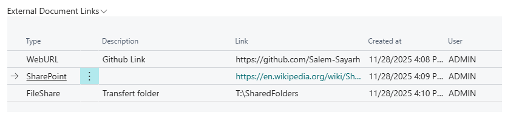
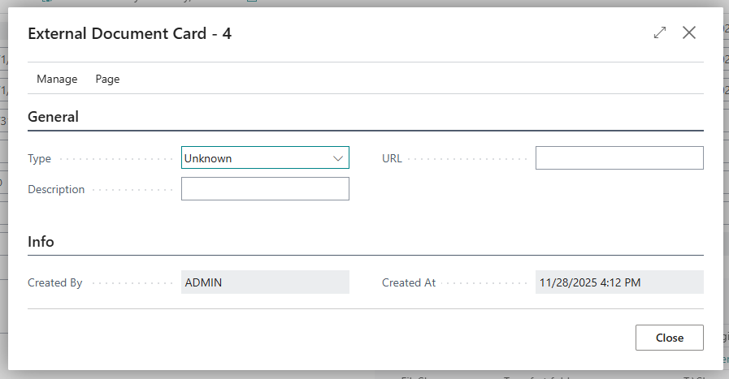
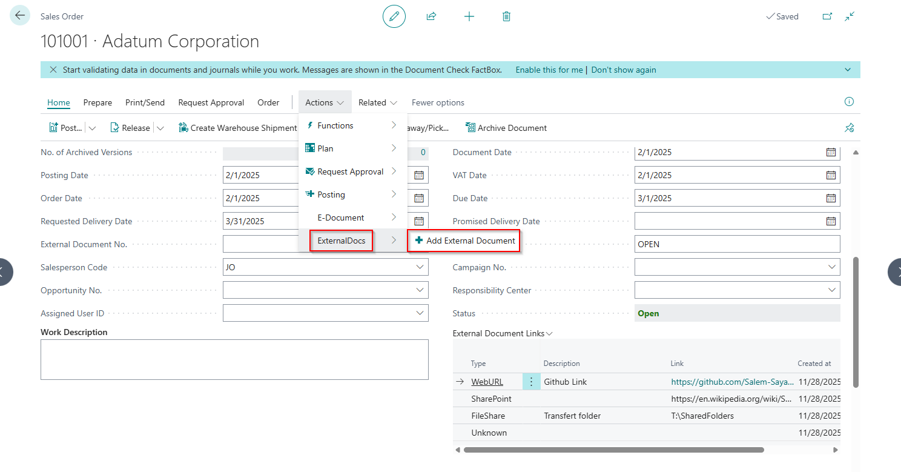

# BC_External-Document-Linker

Attach external document links to sales and purchase documents in Business Central.

---

## 1. Business Problem

In many cases, key information related to a Sales or Purchase document lives **outside** Business Central:

- SharePoint folders with specifications or contracts  
- OneDrive or file share links with quotes, drawings, PDFs  
- External web URLs (portals, tracking pages, etc.)

Users typically:

- Paste links into the **comment lines**  
- Store them in **email** or **Teams**  
- Or just **remember** them 😅  

This makes it hard to:

- See **all related external documents** for a Sales Order / Purchase Order in one place  
- Quickly **open or edit** those links  
- Track **who added what and when**

This extension solves that by adding a **simple link management layer** directly on Sales and Purchase documents.

---

## 2. What the Extension Does

### 2.1. External Document Link Storage

- New table: `External Document Link`
- Stores:
  - Linked **table** (Sales Header, Purchase Header, etc.)
  - **Document No.**
  - **Type** (SharePoint, Web URL, etc. – via enum)
  - **Description**
  - **URL**
  - **Created By**
  - **Created At**

> Each document (e.g. one Sales Order) can have **multiple** external links.

---

### 2.2. Links on Sales Orders

- Sales Order page extension:
  - Adds an **“External Documents”** section in the content area
  - Embeds a **ListPart** that shows all links for the current Sales Order
- Actions:
  - **Add External Document**  
    - Opens a card to create a new link pre-linked to the current Sales Order
  - On each link row (line menu):
    - **Open** → opens URL in the browser
    - **Edit** → opens the link on the card for editing
    - **Delete** → removes the link after confirmation

---

### 2.3. Links on Purchase Orders

- Same concept as Sales Orders:
  - Purchase Order page extension
  - Shows the **External Document Links** for the current Purchase Order
  - Uses the same ListPart + actions (Add, Open, Edit, Delete)

---

### 2.4. External Document Card

- Card page to create/edit a single link:
  - Select **Type**
  - Enter **Description**
  - Paste the **URL**
- Audit fields:
  - **Created By** (user ID)
  - **Created At** (timestamp)
- Audit fields are set automatically when a new record is created.

---

### 2.5. Permissions

- Permission set: `External Docs Mgt`
  - Grants access to:
    - `External Document Link` table data
    - `External Document Card`
    - `External Document ListPart`
- Can be assigned to users who should **view/manage external links**.

---

## 3. How It Works (Technical Flow – Short)

1. User opens a **Sales Order** / **Purchase Order**.  
2. The **External Documents** area shows all `External Document Link` rows where:
   - `TableID` = Sales Header / Purchase Header  
   - `DocumentNo` = document’s `"No."`
3. User clicks **“Add External Document”**:
   - A new `External Document Link` record is created and linked to the document.
   - The card opens so the user can fill **Type / Description / URL**.
4. The ListPart automatically refreshes and shows the new link.
5. From the ListPart, the user can:
   - **Open** the URL (browser)
   - **Edit** the link (card)
   - **Delete** the link.

---

## 4. Screenshots

### 4.1. Sales Order – External Documents Section

---

### 4.2. External Document Card

---

### 4.3. Action - Add External Document

---

## 5. Notes / Ideas for Future Enhancements

- Support more document types (Quotes, Invoices, Credit Memos, etc.)
- Additional link types (e.g. DMS, ticket systems)
- Automatic link creation via events or integrations
- Filtering/grouping links by type or business process

